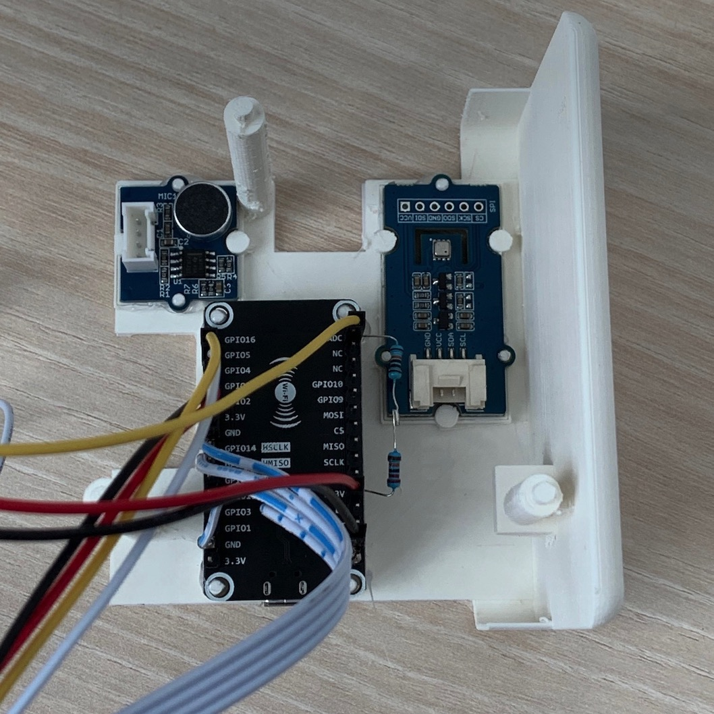
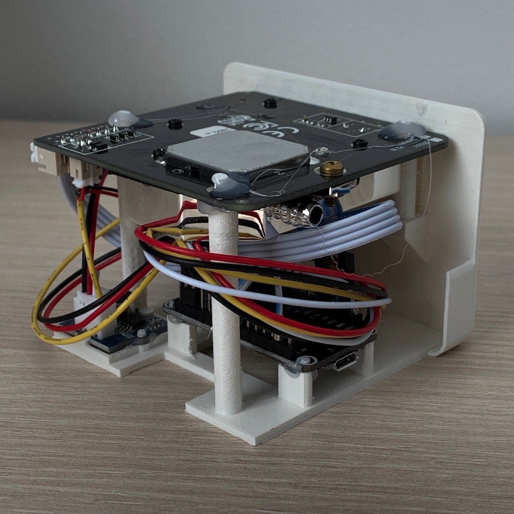
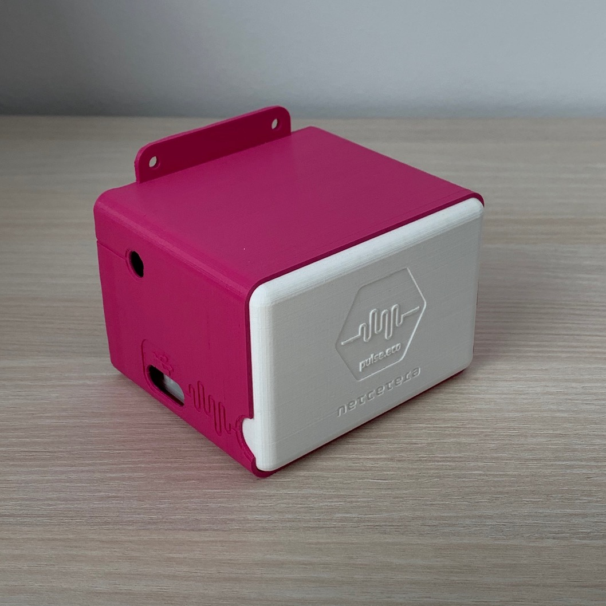

# pulse.eco Wi-Fi V2 3D printed sensor box

## Pieces

The starting idea of this 3D printed box is to have a components holder element which slides into an enclosure. Therefore, in this folder you can find two files that you need to print:
- components_plate.stl - the base where all the components will be mounted and secured
- box.stl - the enclosure in which the components_plate slides into

## Printing settings

For the best outcome, these are the recommended printing settings (might need to be tuned in order to fit your 3d printer more nicely)
- Layer height: 0.1mm
- Wall width: 0.8mm
- Print speed: 50mm/s with 90mm/s travel
- Plate adhesion: 4mm Brim.

Quite decent results but with a bit damaged details can be achieved with a 0.15mm or even 0.2mm layer height and at least 0.6mm wall width.

There's no need to use supports. Just make sure to always lay the elements on the obvious flat side.

## Assembly instructions

Start with mounting the base elements: NodeMCU, Noise sensor, BME sensor

Additionally, attach and secure the cables to the board now, and secure the board elements either with hot glue or super glue.

Next, connect the SDS011 sensor and place it on top of the components plate, resting on the three pillars:

If the sensor wiggles, secure it with hot glue as well. 

Be careful with managing the cables in the process. The SDS sensor can press on the board and the cables, and might damage either them or itself. When done, slide the whole components set into the enclosure:

Usually, the box and the front plate should tight fit. However, in some occasions, a bit of glue might be necessary to secure it completely.