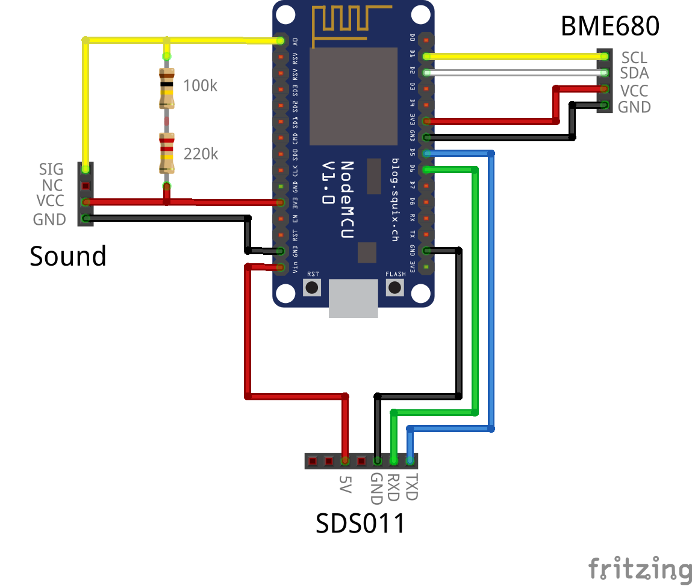

# pulse.eco Wi-Fi sensor v2

## Description

This document describes how to construct and prepare the "pulse.eco Wi-Fi sensor version 2". It is a device based on the ESP8266 chip by Espressif that uses Wi-Fi and HTTPS data transmission.

If you want only to build and configure sensor of your own, visit the [construct page at the pulse.eco](https://pulse.eco/construct) to find a simpler tutorial.
Also, for more detailed explanation for the construction, packaging and extra, visit the same page.

## Requirements

Before planning on constructing a pulse.eco device, contact your community leader first. It's up to them to verify whether or not you satisfy the conditions in order to provide valid data.

For the "pulse.eco Wi-Fi sensor v2", the basic requirements are:
- the device needs to be placed outside (balcony or yard), fixed to a wall, and protected from direct sunlight and rain.
- the Wi-Fi reception at the place of installation should be solid
- the device needs to be placed away from active sources of contamination (anything that produces smoke, vibration or sound, e.g.: ashtray, airconditioner, chimney, very close construction site)
- the device needs to face the louder side of the object, so that the noise measurement is more realistic
- the device must not be installed very high (more than 3 or 4 stories) because the air pollution measurement will be unreliable

## Shopping list

All of the components needed can easily be ordered on several on-line shops.
Core components:
- NodeMCU - [AliExpress](https://www.aliexpress.com/item/2015-New-product-Wireless-module-NodeMcu-Lua-Wifi-Nodemcu-WIFI-Network-Development-Board-Based-ESP8266-High/32341789414.html?spm=a2g0s.9042311.0.0.22e24c4d6kuP4R)
- Grove sound sensor - [Seeed Studios](https://www.seeedstudio.com/Grove-Sound-Sensor-p-752.html)
- Grove temperature, humidity, pressure and gas sensor (based on BME680) -[Seed Studios](https://www.seeedstudio.com/Grove-Temperature-Humidity-Pressure-and-Gas-Sensor-BME68-p-3109.html)
- Nova SDS011 PM sensor - [AliExpress](https://www.aliexpress.com/item/Nova-PM-sensor-SDS011-High-precision-laser-pm2-5-air-quality-detection-sensor-module-Super-dust/32606349048.html?spm=a2g0s.9042311.0.0.27424c4dbiW3M6)
- Resistors: 100kOhms and 220kOhms - [AliExpress](https://www.aliexpress.com/item/600pcs-set-30-Kinds-1-4W-Resistance-1-Metal-Film-Resistor-Pack-Assorted-Kit-1K-10K/32840627690.html)
- Optional: 5x7cm PCB (if you're willing to solder, and especially if you're using our 3D printed enclosure) - [AliExpress](https://www.aliexpress.com/item/5pcs-lot-5x7-Double-Side-Copper-Prototype-PCB-Universal-Board-Experimental-Development-Plate/32916823461.html?spm=2114.search0104.3.268.428022f653MFZR&ws_ab_test=searchweb0_0,searchweb201602_5_10065_10068_319_10059_10884_317_10887_10696_100031_321_322_10084_453_10083_454_10103_10618_10307_538_537_536,searchweb201603_51,ppcSwitch_0&algo_expid=ddad3e93-42bd-4572-8c76-a1f74a61bb20-38&algo_pvid=ddad3e93-42bd-4572-8c76-a1f74a61bb20)

Note: the device will work with a subset of the sensors and will transmit only the available data. However, fox maximum usability, please include all the needed parts.

If you're not willing or able to solder, you can use some jumper cables:
- mixed short jumper cables set - [AliExpress](https://www.aliexpress.com/item/Free-shipping-Dupont-line-120pcs-10cm-male-to-male-male-to-female-and-female-to-female/2041500641.html)
- grove female jumper cables - [AliExpress](https://www.aliexpress.com/item/Grove-4-Female-Jumper-to-Grove-pin-4-pin-110990028-module/32655987703.html?spm=a2g0s.9042311.0.0.22e24c4d6kuP4R)
  
Powering
- Micro USB cable
- 5V / 1A DC adapter

## Assembly

The scheme for the connection of the core components is as following:

The code for the device is aware of the connected sensors to it, so even if one of them mailfunctions or it's completely missing, it will just be ignored and those values will not be sent to the platform.

## Using the firmware

First, download and install the latest Arduino IDE. Initially it comes configured for the standard Arduino boards, so you need to extend it to use ESP8266 boards as well. For that, follow the instructions with the Board Manager as described [here](https://github.com/esp8266/Arduino).

Next, you need to install the necessary device driver in order to be able to communicate with the NodeMCU.
In general, [the official device driver options](https://www.silabs.com/products/development-tools/software/usb-to-uart-bridge-vcp-drivers) should do.
However, if you're experiencing problems, you might wanna check with a [different option here](https://github.com/nodemcu/nodemcu-devkit/tree/master/Drivers), or if you're using MacOS, [maybe even here](https://github.com/adrianmihalko/ch340g-ch34g-ch34x-mac-os-x-driver).

Start the Arduino IDE. Before loading the sketch, you need to make sure that everything else is prepared:
- from the Tools -> Board menu, select NodeMCU 1.0
- open the Sketch -> Include Library -> Manage libraries menu item and make sure that you have the following libraries installed: Adafruit Unified Sensor, Adafruit BME680 and Adafruit BME280.

Finally plug in your board. If everything is fine, you should see a valid entry to select in the Tools -> Port menu.  

When flashing, in general, the NodeMCU realizes that the computer is initiating a flash, and sets the ESP chip into flash mode. 
However, with some devices this doesn't happen. If you encounter such a problem, click and hold the Flash button on the NodeMCU, press upload in the Arudino IDE, and see if this will start the flashing procedure. If yes, and you can release the flash button.

## Configuration

Place the sensor firmly at the target location and power it up.
Inside there is a status LED:
- if it blinks, it means the device is booting up or trying to connect to the network
- if it turns off, it means it has successfully connected
- if it turns on, it means it has entered into configuration mode

While in configuration mode, it broadcasts its own network. The name of that network should start with 'PulseEcoSensor'. Using your phone or laptop, join it. There is no password. Be patient as it may take up to a minute for some mobile devices to connect.
Once connected, open up a browser and go to "http://192.168.1.1/" (without the quotes). A configuration page with three fields should open up:
- Device key: here you should enter the Device Key that will be given to you by your community leader
- SSID: the name of your Wi-Fi network to which you want to connect the device
- Paswword: the password of the said Wi-Fi network
Double check if all the data is correct, and click submit. The device will save the configuration and reboot.

If everything is fine, than the device should connect to the network, and start it's work. The first information should be visible within 15-30 minutes.
Whenever the device is restarted, it keeps it's configuration settings. If for some reason it cannot connect to the network, or the connection is interrupted, it will reboot, and put itself again in configuration mode for 10 minutes. Then it will try again.