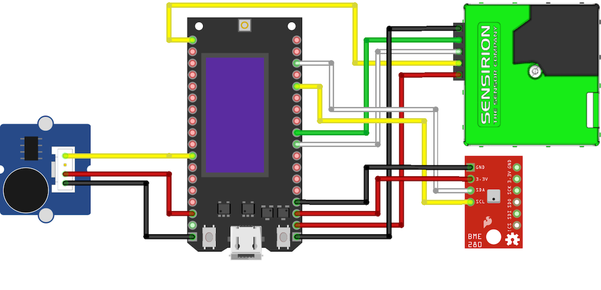

# pulse.eco TT-Go WiFi/LoRaWAN device v3

## Description

This document describes how to construct and prepare the "pulse.eco TT-GO combo sensor version 3". It is a device based on the ESP-32 chip by Espressif that can work either via Wi-Fi or LoRaWAN.

If you want only to build and configure sensor of your own, visit the [construct page at the pulse.eco](https://pulse.eco/construct) to find a simpler tutorial.
Also, for more detailed explanation for the construction, packaging and extra, visit the same page.

## Requirements

Before planning on constructing a pulse.eco device, contact your community leader first. It's up to them to verify whether or not you satisfy the conditions in order to provide valid data.

For the "pulse.eco TT-Go WiFi/LoRaWAN device", the basic requirements are:
- the device needs to be placed outside (balcony or yard), fixed to a wall, and protected from direct sunlight and rain.
- the Wi-Fi / LoRaWAN reception at the place of installation should be solid
- the device needs to be placed away from active sources of contamination (anything that produces smoke, vibration or sound, e.g.: ashtray, airconditioner, chimney, very close construction site)
- the device needs to face the louder side of the object, so that the noise measurement is more realistic
- the device must not be installed very high (more than 3 or 4 stories) because the air pollution measurement will be unreliable

## Components

Necessary components for assembling the device:
- TT-GO v1.3 board with OLED screen
- Sensirion SPS30 Particle Meter sensor
- BME280 Temperature / Humidity / Air Pressure sensor
- Seeed Grove Sound Sensor
- Jumper cables if not provided

Powering
- Micro USB cable
- 5V / 1A DC adapter

## Assembly

The scheme for the connection of the core components is as following:



The code for the device is aware of the connected sensors to it, so even if one of them mailfunctions or it's completely missing, it will just be ignored and those values will not be sent to the platform.

## Install the ESP32 board in Arduino IDE

Details available [here](https://randomnerdtutorials.com/installing-the-esp32-board-in-arduino-ide-windows-instructions/)

## Needed libraries

In order for the sketch to work, these libraries must be installed. Some of them you might need to install them manually:

- MCCI LoRaWAN LMIC Library v. 4.1.0
- MCCI Arduino LoRaWAN Library v. 0.9.1
- ESPSoftwareSerial v. 6.14.1 ?
- Adafruit Unified Sensor v. 1.0.2
- Adafruit BME280 Library v. 1.0.7
- Adafruit BME680 Library v. 1.0.7
- Adafruit GFX Library v. 1.4.13
- Adafruit SSD1306 Library v. 1.2.9

## Configure MCCI LMIC

Before using the LMIC lib, it needs to be configured propertly for the region. Find the lmic_project_config.h within the library itself. On MacOS, that is in ``~/Documents/Arduino/libraries/MCCI_LoRaWAN_LMIC_library/project_config `` . Edit the file so that it's configured for eu868:

```
// project-specific definitions
#define CFG_eu868 1
//#define CFG_us915 1
//#define CFG_au915 1
//#define CFG_as923 1
// #define LMIC_COUNTRY_CODE LMIC_COUNTRY_CODE_JP      /* for as923-JP; also define CFG_as923 */
//#define CFG_kr920 1
//#define CFG_in866 1
#define CFG_sx1276_radio 1
//#define LMIC_USE_INTERRUPTS
```

At the moment, the source code is configured to work with the TTGO LoRa32 V1. If you need to use a different ESP32 + RFM device, you might need to adapt the pin settings:

```
// Pin mapping
// Allegedly compatible with TTGO LoRa32 V1
const lmic_pinmap lmic_pins = {
    .nss = 18,                       
    .rxtx = LMIC_UNUSED_PIN,
    .rst = 14,                       
    .dio = {26, 33, 32}, 
};
```

## Device configuration

Place the sensor firmly at the target location and power it up.
Read the status of the device by the text displayed on the small OLED screen:
- Config: means the device is not yet configured, or the entered configuration has failed and it's currently broadcasting own network for configuration.
- Init: the device is initializing
- Waiting on first poll: the device is operating, but still hasn't made its first measurements yet
- Data: the last readout measurements that have been sent to pulse.eco

While in configuration mode, the device its own network. The name of that network should start with 'PulseEcoSensor'. Using your phone or laptop, join it. There is no password. Be patient as it may take up to a minute for some mobile devices to connect.
Once connected, open up a browser and go to "http://192.168.4.1/" (without the quotes). A configuration page with three fields should open up.
On the first screen, choose how you'd like your device to operate:
- WiFI - means that the device must connect to your home WiFi and send the data to pulse.eco through it
- LoRaWAN - the device will use LoRaWAN via TTN for data tranmission and can either broadcast its own WiFi or connect to your home WiFI for reconfiguration and status checks.

For WiFi Config:
- Device key: here you should enter the Device Key that will be given to you once you register the device in <your-city>.pulse.eco
- SSID: the name of your Wi-Fi network to which you want to connect the device
- Paswword: the password of the said Wi-Fi network

For LoRaWAN config:
- WIFi selection: whether youd like the device to broadcast its own protected WiFi or connect to your home one, only for reconfiguration and status checks
- Device address / NWSS Key / APPS key: keys given to you once you register the device in <your-city>.pulse.eco
- Wifi SSID/Password: the self broadcast or home wifi details

Double check if all the data is correct, and click submit. The device will save the configuration and reboot. You can additionally open http://pulse-eco.local/ if you choose the device to connect to your home WiFi.

If everything is fine, than the device should connect to the network, and start it's work. The first information should be visible within 15-30 minutes.
Whenever the device is restarted, it keeps it's configuration settings. If for some reason it cannot connect to the network, or the connection is interrupted, it will reboot, and put itself again in configuration mode for 10 minutes. Then it will try again.